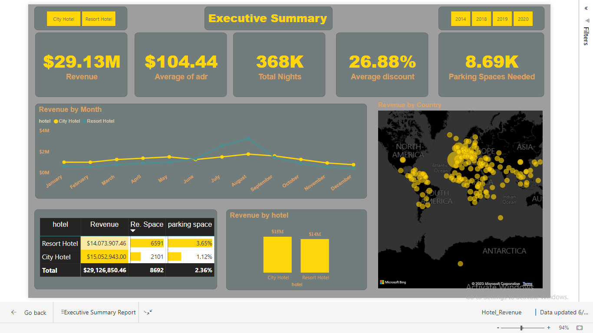

# Title: Hotel Revenue Analysis and Parking Lot Evaluation - Power BI Visual Report
### Dashboard Screenshort
 

---

### Introduction:

This Power BI visual report provides a comprehensive analysis of hotel revenue growth, evaluates the need for an increase in parking lot size, and explores significant trends derived from the available data. The report aims to assist stakeholders in making informed decisions and optimizing hotel operations.

---

### Problem Statements:

#### 1. Is Hotel Revenue Growing by Year?
In order to assess the revenue growth of the hotel, this report analyzes the financial data from multiple years. By examining the revenue trends over time, stakeholders can gain insights into the hotel's financial performance and identify opportunities for improvement.

#### 2. Should We Increase Parking Lot Size?
Addressing the parking needs of guests is crucial for providing a satisfactory experience. This report evaluates the adequacy of the existing parking lot by analyzing parking utilization data. It helps stakeholders determine whether increasing the parking lot size is necessary to meet the demand and enhance customer satisfaction.

#### 3. What Trends Can We See in the Data?
The report utilizes various data visualization techniques to uncover patterns, trends, and correlations within the hotel data. By examining metrics such as occupancy rates, average daily rates, and customer feedback scores, stakeholders can gain a deeper understanding of the factors influencing hotel performance and identify actionable insights.

---

### Skills Needed:
- PostgreSQL
- Power BI
- Data modeling
- Dax Formula
- Calculated Columns a Measures

---

### To create a visual report using Power BI to address the problem statements, we'll follow these steps:

#### Step 1: Creating the Hotel Database and Importing Tables
- Create a database named "Hotel."
- Import the following tables in .csv format into the "Hotel" database: "2018," "2019," "2020," "meal_cost," and "market_segment."
  
#### Step 2: Preparing the Targeted Dataset Using SQL Query
- Use SQL queries to extract and transform the required data for analysis.
- Write SQL queries to retrieve data related to hotel revenue, parking lot size, and trends from the imported tables.
- Combine the necessary information into a single dataset that will serve as the basis for the Power BI report.
  
#### Step 3: Connect the Database to Power BI Dynamically
Open Power BI and choose "Get Data" to connect to the "Hotel" database.
Select the appropriate database connection method and credentials to establish the connection.
Retrieve the required tables or write custom SQL queries to fetch the prepared dataset.

#### Step 4: Creating the Report
- Design the report layout and structure based on the problem statements.
- Use Power BI's visualizations, such as charts, tables, and graphs, to present the information effectively.
- Utilize DAX (Data Analysis Expressions) formulas, calculated columns, and measures to perform calculations and create dynamic visualizations.

#### Step 5: Publish and Share:
- Once completed building report, publish it to the Power BI service to make it available to stakeholders.
- Share the report with stakeholders by providing them with the necessary access or embedding the report in a website or portal.
- Regularly update the report as new data becomes available to ensure stakeholders have access to the latest information.

By presenting this visual report, stakeholders can gain valuable insights into the hotel's revenue growth, make informed decisions regarding parking lot expansion, and identify emerging trends. This report serves as a comprehensive tool for data-driven decision-making and optimizing hotel operations.

---

### Included Files:
1. Hotel_Executive_summary.pbix: Power BI interactive dashboard.
2. tergated_dataSet.sql: SQL script used to generate the targeted data for creating the dashboard.
3. Report_Screenshort.png: Screenshot of the Power BI Dashboard.
4. raw_data: Folder containing the 5 raw tables in CSV format used in the database to generate the targeted data.

### [Click here for the Interactive DashBoard](https://app.powerbi.com/view?r=eyJrIjoiMGMyZmEwMzEtZWFmNi00ZWE2LTlkYzEtY2IxY2E1MWQ5YjhjIiwidCI6ImU1YzgyM2EyLTgzMDktNDNhZi1hZTIxLWI1NzE2ZTliZmQ5OSIsImMiOjEwfQ%3D%3D)

